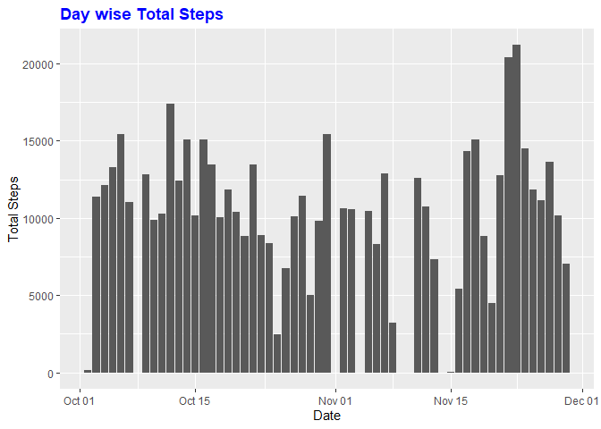
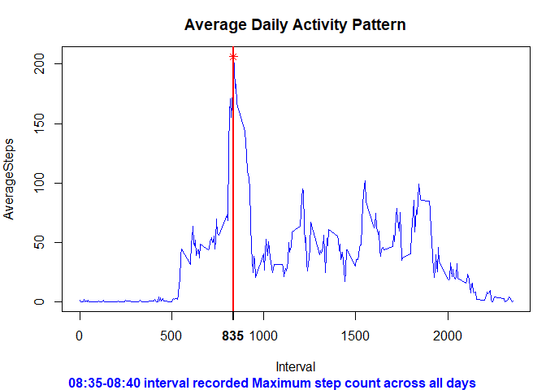
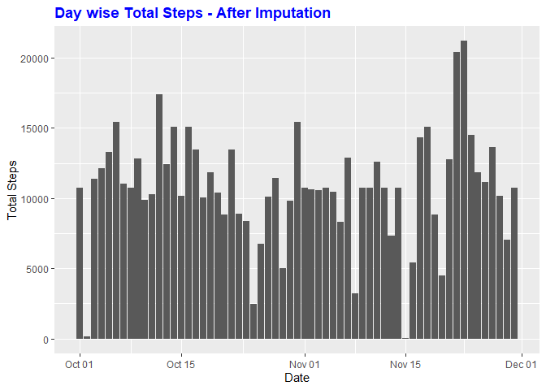
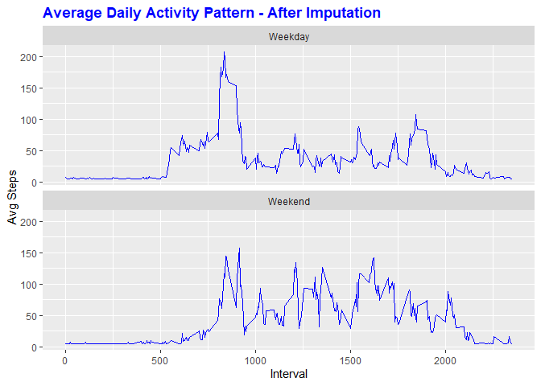

## Loading and preprocessing the data
#### Load the required libraries


```r
library(data.table)
library(ggplot2)
library(Hmisc)
library(plyr)
library(knitr)
```

#### Unzip the Activity data file and load into a Data Table


```r
unzip("./activity.zip")

actDT <- data.table::as.data.table(x = read.csv("./activity.csv",header = TRUE, 
                                                sep=",",stringsAsFactors = FALSE))
actDT$date <- data.table::as.IDate(actDT$date,"%Y-%m-%d")
```

## Q1-What is mean total number of steps taken per day?

#### Calculate the total number of steps taken per day,mean and median values


```r
stepsDay <- actDT[, round(sum(steps)), by=date]
names(stepsDay) <- c("date", "StepCount")

meanStepsDay <- actDT[, round(mean(steps, na.rm = TRUE)), by=date]
medianStepsDay <- actDT[, round(median(steps, na.rm = TRUE)), by=date]
names(meanStepsDay) = c("date", "mean")
names(medianStepsDay)= c("date", "median")
actMeanMedian <- merge(meanStepsDay,medianStepsDay)
```

#### Plot a histogram of the total number of steps taken per day


```r
ggplot(stepsDay, aes(stepsDay$date, stepsDay$StepCount), na.action=na.omit) + 
  geom_histogram(na.rm = TRUE, stat = "identity") +
    theme(plot.title=element_text(face=2, hjust = 0, color="blue")) +
  labs(title = "Day wise Total Steps", x="Date", y="Total Steps") 
```

<!-- -->

#### Report Mean and Median of the total number of steps taken per day


```r
knitr::kable(actMeanMedian, caption = "Mean and Median of the total number of steps taken per day", format = "markdown")
```


|date       | mean| median|
|:----------|----:|------:|
|2012-10-01 |  NaN|     NA|
|2012-10-02 |    0|      0|
|2012-10-03 |   39|      0|
|2012-10-04 |   42|      0|
|2012-10-05 |   46|      0|
|2012-10-06 |   54|      0|
|2012-10-07 |   38|      0|
|2012-10-08 |  NaN|     NA|
|2012-10-09 |   44|      0|
|2012-10-10 |   34|      0|
|2012-10-11 |   36|      0|
|2012-10-12 |   60|      0|
|2012-10-13 |   43|      0|
|2012-10-14 |   52|      0|
|2012-10-15 |   35|      0|
|2012-10-16 |   52|      0|
|2012-10-17 |   47|      0|
|2012-10-18 |   35|      0|
|2012-10-19 |   41|      0|
|2012-10-20 |   36|      0|
|2012-10-21 |   31|      0|
|2012-10-22 |   47|      0|
|2012-10-23 |   31|      0|
|2012-10-24 |   29|      0|
|2012-10-25 |    9|      0|
|2012-10-26 |   24|      0|
|2012-10-27 |   35|      0|
|2012-10-28 |   40|      0|
|2012-10-29 |   17|      0|
|2012-10-30 |   34|      0|
|2012-10-31 |   54|      0|
|2012-11-01 |  NaN|     NA|
|2012-11-02 |   37|      0|
|2012-11-03 |   37|      0|
|2012-11-04 |  NaN|     NA|
|2012-11-05 |   36|      0|
|2012-11-06 |   29|      0|
|2012-11-07 |   45|      0|
|2012-11-08 |   11|      0|
|2012-11-09 |  NaN|     NA|
|2012-11-10 |  NaN|     NA|
|2012-11-11 |   44|      0|
|2012-11-12 |   37|      0|
|2012-11-13 |   25|      0|
|2012-11-14 |  NaN|     NA|
|2012-11-15 |    0|      0|
|2012-11-16 |   19|      0|
|2012-11-17 |   50|      0|
|2012-11-18 |   52|      0|
|2012-11-19 |   31|      0|
|2012-11-20 |   16|      0|
|2012-11-21 |   44|      0|
|2012-11-22 |   71|      0|
|2012-11-23 |   74|      0|
|2012-11-24 |   50|      0|
|2012-11-25 |   41|      0|
|2012-11-26 |   39|      0|
|2012-11-27 |   47|      0|
|2012-11-28 |   35|      0|
|2012-11-29 |   24|      0|
|2012-11-30 |  NaN|     NA|

## Q2-What is the average daily activity pattern?

#### Compute averaged steps taken by interval and the maximum number of steps taken


```r
stepsInterval <- actDT[, mean(steps, na.rm = TRUE), by=interval]
names(stepsInterval) =c("Interval", "AverageSteps")

stepsIntervalMax <- stepsInterval[stepsInterval[, AverageSteps==max(AverageSteps, na.rm = TRUE)]]
```

#### Set margins; plot the daily activity pattern and mark the interval when maximum number of steps taken


```r
par(mar=c(4,4,3,1), oma=c(1,0,0,0), xpd=FALSE)

with(stepsInterval, plot(Interval, AverageSteps, type="l", col="blue"))
title(main="Average Daily Activity Pattern", col="red", font=2)
points(stepsIntervalMax[,1], stepsIntervalMax[,2], pch=8, col="red")
abline(v=stepsIntervalMax[,1], lty=1, lwd=2, col="red")
axis(side=1, label=TRUE, at=stepsIntervalMax[,1], lwd=2, font = 2)

mtext("08:35-08:40 interval recorded Maximum step count across all days",side=1, 
      outer=TRUE, font = 2, col="blue")
```

<!-- -->

## Q3-Imputing missing values
#### Compute and print total number of missing values


```r
print(paste("Total Number of Missing Values in Dataset is: ", sum(is.na(actDT))))
```

```
## [1] "Total Number of Missing Values in Dataset is:  2304"
```

#### Imputing strategy is to replace NAs with the mean of the step count; Add a new column after imputing NAs


```r
actDTImputed <- plyr::mutate(actDT, stepsImputed=Hmisc::impute(actDT$steps,fun=mean))
actDTImputed$date <- as.IDate(actDTImputed$date,"%Y-%m-%d")
```

#### Create a new dataset after imputing missing values for further processing


```r
actDTImputed_New <- as.data.table(actDTImputed[,c(2,3,4)])
actDTImputed_New$stepsImputed <- as.numeric(actDTImputed_New$stepsImputed)
```

#### Compute day-wise total step count, mean, median and step count


```r
stepsDayImputed <- actDTImputed_New[, round(sum(stepsImputed)), by=date]
names(stepsDayImputed) <- c("date", "StepCount")

meanStepsDayImputed <- actDTImputed_New[, round(mean(stepsImputed, na.rm = TRUE)), by=date]
medianStepsDayImputed <- actDTImputed_New[, round(median(stepsImputed, na.rm = TRUE)), by=date]
names(meanStepsDayImputed) = c("date", "mean")
names(medianStepsDayImputed)= c("date", "median")
actMeanMedianImputed <- merge(meanStepsDayImputed,medianStepsDayImputed)
```

#### Histogram for total number of steps taken each day after imputation


```r
ggplot(stepsDayImputed, aes(stepsDayImputed$date, stepsDayImputed$StepCount), na.action=na.omit) + 
  geom_histogram(na.rm = TRUE, stat = "identity") +
  theme(plot.title=element_text(face=2, hjust = 0, color="blue")) +
  labs(title = "Day wise Total Steps - After Imputation", x="Date", y="Total Steps") 
```

<!-- -->

#### Mean/Median Step count per each day after imputation


```r
knitr::kable(actMeanMedianImputed, caption="Mean/Median Step count per each day after imputation", format = "markdown")
```


|date       | mean| median|
|:----------|----:|------:|
|2012-10-01 |   37|     37|
|2012-10-02 |    0|      0|
|2012-10-03 |   39|      0|
|2012-10-04 |   42|      0|
|2012-10-05 |   46|      0|
|2012-10-06 |   54|      0|
|2012-10-07 |   38|      0|
|2012-10-08 |   37|     37|
|2012-10-09 |   44|      0|
|2012-10-10 |   34|      0|
|2012-10-11 |   36|      0|
|2012-10-12 |   60|      0|
|2012-10-13 |   43|      0|
|2012-10-14 |   52|      0|
|2012-10-15 |   35|      0|
|2012-10-16 |   52|      0|
|2012-10-17 |   47|      0|
|2012-10-18 |   35|      0|
|2012-10-19 |   41|      0|
|2012-10-20 |   36|      0|
|2012-10-21 |   31|      0|
|2012-10-22 |   47|      0|
|2012-10-23 |   31|      0|
|2012-10-24 |   29|      0|
|2012-10-25 |    9|      0|
|2012-10-26 |   24|      0|
|2012-10-27 |   35|      0|
|2012-10-28 |   40|      0|
|2012-10-29 |   17|      0|
|2012-10-30 |   34|      0|
|2012-10-31 |   54|      0|
|2012-11-01 |   37|     37|
|2012-11-02 |   37|      0|
|2012-11-03 |   37|      0|
|2012-11-04 |   37|     37|
|2012-11-05 |   36|      0|
|2012-11-06 |   29|      0|
|2012-11-07 |   45|      0|
|2012-11-08 |   11|      0|
|2012-11-09 |   37|     37|
|2012-11-10 |   37|     37|
|2012-11-11 |   44|      0|
|2012-11-12 |   37|      0|
|2012-11-13 |   25|      0|
|2012-11-14 |   37|     37|
|2012-11-15 |    0|      0|
|2012-11-16 |   19|      0|
|2012-11-17 |   50|      0|
|2012-11-18 |   52|      0|
|2012-11-19 |   31|      0|
|2012-11-20 |   16|      0|
|2012-11-21 |   44|      0|
|2012-11-22 |   71|      0|
|2012-11-23 |   74|      0|
|2012-11-24 |   50|      0|
|2012-11-25 |   41|      0|
|2012-11-26 |   39|      0|
|2012-11-27 |   47|      0|
|2012-11-28 |   35|      0|
|2012-11-29 |   24|      0|
|2012-11-30 |   37|     37|

#### Compare Mean, Median and Total Stepcount values, before and after imputation


```r
compMeanMedian <- merge(actMeanMedian,actMeanMedianImputed)
compMeanMedian <- cbind.data.frame(compMeanMedian,stepsDay[,2],stepsDayImputed[,2])
names(compMeanMedian) = c("date","Mean-BI","Median-BI","Mean-AI","Median-AI", "TotalSteps-BI","TotalSteps-AI")
```

#### Comparison table


```r
knitr::kable(compMeanMedian[,c(1,2,4,3,5,6,7)], caption = "Comparison Table", format = "markdown")
```


|date       | Mean-BI| Mean-AI| Median-BI| Median-AI| TotalSteps-BI| TotalSteps-AI|
|:----------|-------:|-------:|---------:|---------:|-------------:|-------------:|
|2012-10-01 |     NaN|      37|        NA|        37|            NA|         10766|
|2012-10-02 |       0|       0|         0|         0|           126|           126|
|2012-10-03 |      39|      39|         0|         0|         11352|         11352|
|2012-10-04 |      42|      42|         0|         0|         12116|         12116|
|2012-10-05 |      46|      46|         0|         0|         13294|         13294|
|2012-10-06 |      54|      54|         0|         0|         15420|         15420|
|2012-10-07 |      38|      38|         0|         0|         11015|         11015|
|2012-10-08 |     NaN|      37|        NA|        37|            NA|         10766|
|2012-10-09 |      44|      44|         0|         0|         12811|         12811|
|2012-10-10 |      34|      34|         0|         0|          9900|          9900|
|2012-10-11 |      36|      36|         0|         0|         10304|         10304|
|2012-10-12 |      60|      60|         0|         0|         17382|         17382|
|2012-10-13 |      43|      43|         0|         0|         12426|         12426|
|2012-10-14 |      52|      52|         0|         0|         15098|         15098|
|2012-10-15 |      35|      35|         0|         0|         10139|         10139|
|2012-10-16 |      52|      52|         0|         0|         15084|         15084|
|2012-10-17 |      47|      47|         0|         0|         13452|         13452|
|2012-10-18 |      35|      35|         0|         0|         10056|         10056|
|2012-10-19 |      41|      41|         0|         0|         11829|         11829|
|2012-10-20 |      36|      36|         0|         0|         10395|         10395|
|2012-10-21 |      31|      31|         0|         0|          8821|          8821|
|2012-10-22 |      47|      47|         0|         0|         13460|         13460|
|2012-10-23 |      31|      31|         0|         0|          8918|          8918|
|2012-10-24 |      29|      29|         0|         0|          8355|          8355|
|2012-10-25 |       9|       9|         0|         0|          2492|          2492|
|2012-10-26 |      24|      24|         0|         0|          6778|          6778|
|2012-10-27 |      35|      35|         0|         0|         10119|         10119|
|2012-10-28 |      40|      40|         0|         0|         11458|         11458|
|2012-10-29 |      17|      17|         0|         0|          5018|          5018|
|2012-10-30 |      34|      34|         0|         0|          9819|          9819|
|2012-10-31 |      54|      54|         0|         0|         15414|         15414|
|2012-11-01 |     NaN|      37|        NA|        37|            NA|         10766|
|2012-11-02 |      37|      37|         0|         0|         10600|         10600|
|2012-11-03 |      37|      37|         0|         0|         10571|         10571|
|2012-11-04 |     NaN|      37|        NA|        37|            NA|         10766|
|2012-11-05 |      36|      36|         0|         0|         10439|         10439|
|2012-11-06 |      29|      29|         0|         0|          8334|          8334|
|2012-11-07 |      45|      45|         0|         0|         12883|         12883|
|2012-11-08 |      11|      11|         0|         0|          3219|          3219|
|2012-11-09 |     NaN|      37|        NA|        37|            NA|         10766|
|2012-11-10 |     NaN|      37|        NA|        37|            NA|         10766|
|2012-11-11 |      44|      44|         0|         0|         12608|         12608|
|2012-11-12 |      37|      37|         0|         0|         10765|         10765|
|2012-11-13 |      25|      25|         0|         0|          7336|          7336|
|2012-11-14 |     NaN|      37|        NA|        37|            NA|         10766|
|2012-11-15 |       0|       0|         0|         0|            41|            41|
|2012-11-16 |      19|      19|         0|         0|          5441|          5441|
|2012-11-17 |      50|      50|         0|         0|         14339|         14339|
|2012-11-18 |      52|      52|         0|         0|         15110|         15110|
|2012-11-19 |      31|      31|         0|         0|          8841|          8841|
|2012-11-20 |      16|      16|         0|         0|          4472|          4472|
|2012-11-21 |      44|      44|         0|         0|         12787|         12787|
|2012-11-22 |      71|      71|         0|         0|         20427|         20427|
|2012-11-23 |      74|      74|         0|         0|         21194|         21194|
|2012-11-24 |      50|      50|         0|         0|         14478|         14478|
|2012-11-25 |      41|      41|         0|         0|         11834|         11834|
|2012-11-26 |      39|      39|         0|         0|         11162|         11162|
|2012-11-27 |      47|      47|         0|         0|         13646|         13646|
|2012-11-28 |      35|      35|         0|         0|         10183|         10183|
|2012-11-29 |      24|      24|         0|         0|          7047|          7047|
|2012-11-30 |     NaN|      37|        NA|        37|            NA|         10766|

##### We see that there is no impact on the mean, median and total step count values by imputation except for imputed rows.


## Q4-Are there differences in activity patterns between weekdays and weekends?

#### Add new factor variable "day" for weekend/weekday


```r
actDTImputed_New <- as.data.table(mutate(actDTImputed_New, day=factor(ifelse(weekdays(actDTImputed_New$date, abbreviate = TRUE) %nin% 
                                            c("Sat","Sun"),"Weekday","Weekend"))))
```

#### Compute average number of steps taken, averaged across weekday/weekend days


```r
stepsIntImputed <- actDTImputed_New[, mean(stepsImputed), by="interval,day"]
names(stepsIntImputed) =c("Interval","day", "AverageStepsImputed")
```

#### Make a panel plot showing Activity Pattern on weekday/weekend days


```r
ggplot(stepsIntImputed, aes(Interval,AverageStepsImputed)) + 
  geom_line(col="blue")+
  facet_wrap(.~day, nrow=2, ncol=1) +
  theme(plot.title=element_text(face=2, hjust = 0, color="blue")) +
  labs(title = "Average Daily Activity Pattern - After Imputation", x="Interval", y="Avg Steps")
```

<!-- -->
